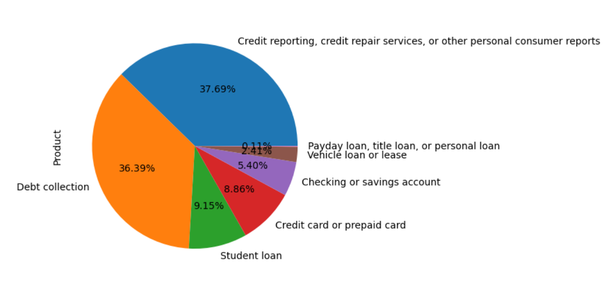
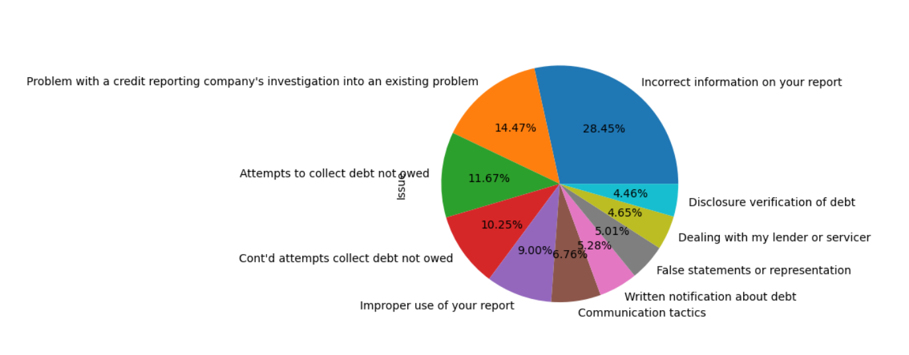

# Imperial_Capstone
# Customer Complaints Catogrisation 

## NON-TECHNICAL EXPLANATION OF YOUR PROJECT
This project focuses on organizing and categorizing customer complaints to improve how businesses respond to and resolve issues. Using advanced machine learning models, we analyze customer narratives and classify them into predefined categories like "Credit reporting issues" or "Debt collection problems." This helps companies quickly identify recurring issues, prioritize critical cases, and improve customer satisfaction. By automating the categorization process, businesses can streamline operations, reduce response times, and allocate resources more efficiently. Ultimately, this system enables organizations to better understand customer concerns and deliver faster, more effective solutions, enhancing the overall customer experience. 

## DATA
For this project, we used a publicly available customer complaints dataset sourced from Kaggle. The dataset contains information about consumer complaints submitted to businesses, including details such as the product category (e.g., "Credit reporting," "Debt collection"), the specific issue reported, the complaint narrative, the company involved, and the resolution status.

This dataset provides a rich source of structured and unstructured data, enabling the categorization of complaints into meaningful categories. The data was cleaned and preprocessed to handle missing values and prepare it for machine learning models.

The dataset can be accessed at the following link: Consumer Complaint Identification Notebook on Kaggle.

### Summary of Steps Taken Earlier

#### **1. Data Loading and Exploration**
- Loaded the dataset from Kaggle using `pandas`.
- Previewed the dataset using `.head()` and checked its shape using `.shape`.
- Identified column names and analyzed missing values with `.isnull().sum()` and calculated the percentage of missing data.
  Below is the split be Product:

  Below is the split be Issue:

#### **2. Data Cleaning**
- Removed or imputed columns with excessive missing values (`Tags`, `Consumer disputed?`).
- Filled missing values in important columns (`State`, `ZIP code`, `Consumer complaint narrative`) with placeholders like `"Unknown"` or `"No narrative provided"`.
- Ensured the `Consumer complaint narrative` column was available for text analysis.

#### **3. Text Preprocessing**
- Cleaned the `Consumer complaint narrative` column:
  - Removed special characters.
  - Converted text to lowercase.
  - Removed stopwords using NLTK.
- Vectorized text using `TfidfVectorizer` to convert narratives into numerical features.

#### **4. Categorical Feature Encoding**
- Encoded categorical features (`State`, `Submitted via`, etc.) using:
  - **Label Encoding**: Converted categories into integers.
  - **One-Hot Encoding**: Created binary columns for categorical features.

#### **5. Feature Combination**
- Combined text features (from TF-IDF) and encoded categorical features using `scipy.sparse.hstack()` to keep memory usage efficient.

#### **6. Data Splitting**
- Split the combined dataset into training and testing sets using `train_test_split`.

## MODEL

### **1. Model Card for Random Forest Classifier**
The Random Forest Classifier is designed to predict customer complaint categories based on textual and categorical input data. The model is used to automate the categorization process, helping businesses respond to customer concerns more efficiently.
[Model Card](ModelCardforRandomForest.md)

## HYPERPARAMETER OPTIMSATION
Description of which hyperparameters you have and how you chose to optimise them. 

## RESULTS
A summary of your results and what you can learn from your model 

You can include images of plots using the code below:

## (OPTIONAL: CONTACT DETAILS)
If you are planning on making your github repo public you may wish to include some contact information such as a link to your twitter or an email address. 
